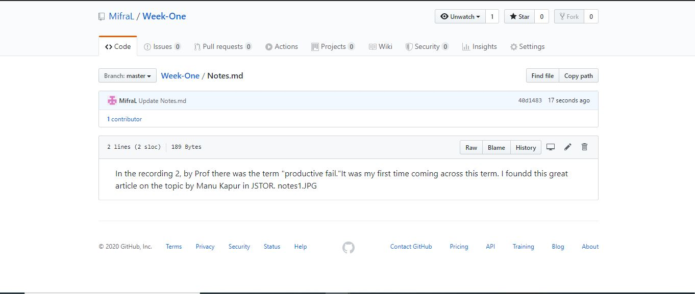
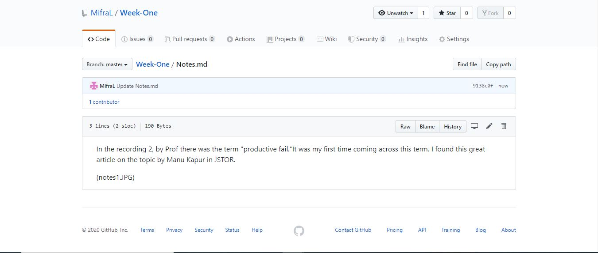
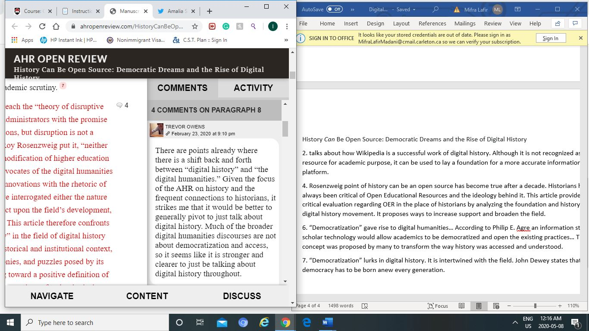
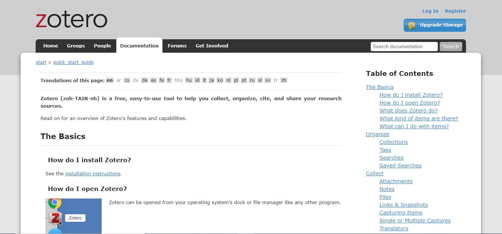

- When I first signed ip for github, I panicked a bit because I skipped the step for choosing the free student pass... Thankfully, my account somehow signed up for the free account!!! 

- I had an issue was with adding an image into the file... then I followed the command in the video exactly as it was and it worked !!!

Once again, I learned that when there's instruction follow them through at every single step and not try to cut corners. 

- For the second reading, it was to take notes using two browser.

- When I was using Zotero, I was confused about how to process so I searched up instructions @google.

The following website was really helpful: https://www.zotero.org/support/quick_start_guide. 

#Helpful websites 

For Zotero, I did find the starter guide to help me a bit because I had a hard time starting out and finding where to go and what to do. 

#Failures I encoutered this week

If there were any failures that I might have encountered, there were minimal to the point that I would not considered them a fail.

- My idea of "digital history."

Prior to this class, I only had a bit of experience in digital history. Last semester, one of my history methods class made us to a project that involved two websites known as scalar and VMAO. The materials that I came across confirmed that notion, it showed a broader scale than I expected like example I did not think Wikipedia was a digital archive nor the library, museum archives. 

- "Digital silences" that I have encoutered.

A digital silence that I personally encountered would be the lack of sources on the LGBTQ+ community specifically on their architecture in Canada. I did a practicum last fall and I had to do research on the topic. It was hard to find any credible sources that were peer reviewed. 

- Where do I want to go with digital history?

A little bit of backround on online assisgments, I did my first two years of undergrad in civil engineering and I hated the assignments that used online tools. Every I used the computer, there would multiple issues and it would take forever for me to complete my tasks. Although I love history, to this particular class I came with prejudice. I expected to not like the content but based on the first week, I can say the lessons were surprisingly interesting and different, in a good way. I did not expect to like using digital tools but they are actually convenient and I know that I will be using some of them (hypothesis) in my other classes. 

I feel a lot of people don't know what exactly digital history is and I believe it is going to prominenly used in the history field. I feel more inclined to learn about it to help with my interests such as heritage conservation. 

