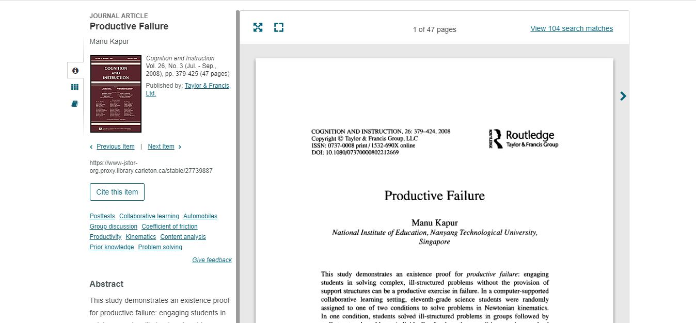

In the recording 2, by Prof there was the term "productive fail."It was my first time coming across this term. I found this great article on the topic by Manu Kapur in JSTOR. 

I used the command for adding the image above which was 

I really liked how the prof's "failures" were mentioned as lessons to be learned.

The first reading by Sharon Leon "Returning Women to the digital history" was really interesting and it reminded me of the Keith Jenkins "Rethinking History."

@https://analepsis.files.wordpress.com/2011/08/re-thinking-history.pdf

The second reading on the AHR open review on if "History Can Be Open Source: Democratic Dreams and the Rise of Digital History." It was surprising because I did not consider wikepedia as part of digital history and I found the discussion around the idea of open source really intriguing. 

This year some of my classes have been about using new sites and posting our final project into a database. These sites are newly made just for the students to contribute. 

#Scalar #VMAO 

The final reading was a thread by Amalia Skarlatou Levi. Two terms that came up was digitalarchives and archivalsilences. 

Digitalarchives

Archivalsilences

